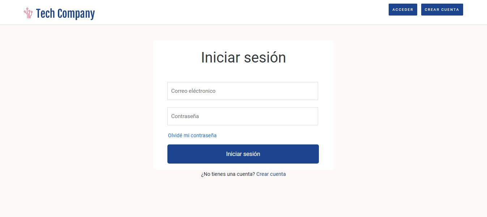

# Blog

<br><br><br>

## Descripción

Este es un proyecto básico de un blog desarrollado en **Laravel (PHP)** y **MySQL**, utilizando el patrón de diseño **MVC** (Modelo-Vista-Controlador). El proyecto permite la creación, lectura, actualización y eliminación (CRUD) de publicaciones.



## Características

- **Gestión de publicaciones**: Crear, editar y eliminar artículos del blog.
- **Patrón MVC**: Separación de responsabilidades en Modelo, Vista y Controlador.
- **Base de datos MySQL**: Integración con una base de datos relacional para almacenar información.
- **Frontend básico**: Diseño simple y funcional para interactuar con el blog.

## Requisitos previos

Antes de comenzar, asegúrate de tener instalado lo siguiente:

- **PHP** >= 7.4
- **Composer** para la gestión de dependencias
- **Servidor web** (Apache, Nginx, etc.)
- **MySQL** o cualquier base de datos compatible con el proyecto

## Instalación

Sigue estos pasos para configurar el proyecto:

1. Clona el repositorio en tu máquina local:

   ```bash
   git clone https://github.com/samoel-andres/blog.git
   cd blog
   ```

2. Configura el archivo `.env` para establecer las credenciales de tu base de datos:

   ```env
   DB_HOST=localhost
   DB_NAME=nombre_base_datos
   DB_USER=usuario
   DB_PASSWORD=contraseña
   ```

3. Inicia el servidor web y accede al proyecto desde tu navegador.

   ```bash
   Accede a http://localhost/blog
   ```

## Uso

1. Navega a la URL donde está alojado el proyecto.
2. Interactúa con el blog para crear, leer, actualizar y eliminar publicaciones.

## Estructura del proyecto

El proyecto sigue la estructura básica del patrón MVC:

- **Modelos**: Contienen la lógica de negocio y la interacción con la base de datos.
- **Vistas**: Se encargan de la interfaz de usuario y muestran la información.
- **Controladores**: Manejan las solicitudes del usuario y actualizan los modelos y las vistas.
